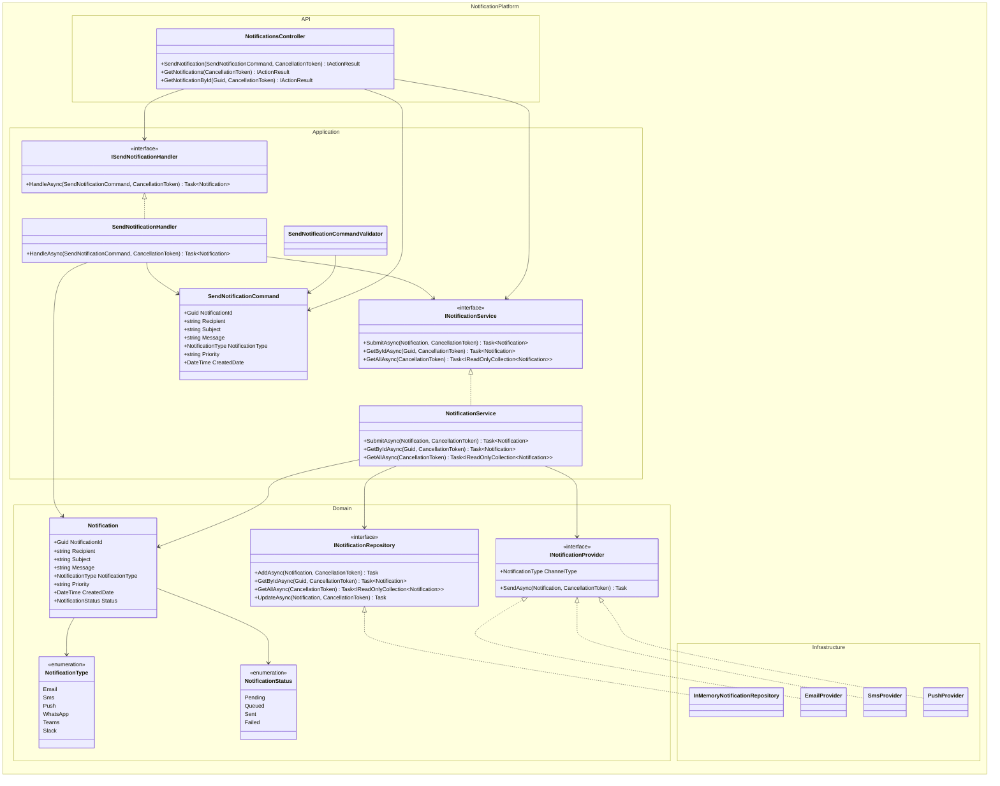

```mermaid
classDiagram
direction LR

namespace NotificationPlatform.Domain {
  class Notification {
	+Guid NotificationId
	+string Recipient
	+string Subject
	+string Message
	+NotificationType NotificationType
	+string Priority
	+DateTime CreatedDate
	+NotificationStatus Status
  }

  class NotificationType {
	<<enumeration>>
	Email
	Sms
	Push
	WhatsApp
	Teams
	Slack
  }

  class NotificationStatus {
	<<enumeration>>
	Pending
	Queued
	Sent
	Failed
  }

  class INotificationProvider {
	<<interface>>
	+NotificationType ChannelType
	+SendAsync(Notification, CancellationToken) Task
  }

  class INotificationRepository {
	<<interface>>
	+AddAsync(Notification, CancellationToken) Task
	+GetByIdAsync(Guid, CancellationToken) Task~Notification~
	+GetAllAsync(CancellationToken) Task~IReadOnlyCollection~Notification~~
	+UpdateAsync(Notification, CancellationToken) Task
  }
}

namespace NotificationPlatform.Application {
  class SendNotificationCommand {
	+Guid NotificationId
	+string Recipient
	+string Subject
	+string Message
	+NotificationType NotificationType
	+string Priority
	+DateTime CreatedDate
  }

  class SendNotificationCommandValidator

  class ISendNotificationHandler {
	<<interface>>
	+HandleAsync(SendNotificationCommand, CancellationToken) Task~Notification~
  }

  class SendNotificationHandler {
	+HandleAsync(SendNotificationCommand, CancellationToken) Task~Notification~
  }

  class INotificationService {
	<<interface>>
	+SubmitAsync(Notification, CancellationToken) Task~Notification~
	+GetByIdAsync(Guid, CancellationToken) Task~Notification~
	+GetAllAsync(CancellationToken) Task~IReadOnlyCollection~Notification~~
  }

  class NotificationService {
	+SubmitAsync(Notification, CancellationToken) Task~Notification~
	+GetByIdAsync(Guid, CancellationToken) Task~Notification~
	+GetAllAsync(CancellationToken) Task~IReadOnlyCollection~Notification~~
  }
}

namespace NotificationPlatform.Infrastructure {
  class InMemoryNotificationRepository
  class EmailProvider
  class SmsProvider
  class PushProvider
}

namespace NotificationPlatform.API {
  class NotificationsController {
	+SendNotification(SendNotificationCommand, CancellationToken) IActionResult
	+GetNotifications(CancellationToken) IActionResult
	+GetNotificationById(Guid, CancellationToken) IActionResult
  }
}

INotificationService <|.. NotificationService
ISendNotificationHandler <|.. SendNotificationHandler
INotificationRepository <|.. InMemoryNotificationRepository
INotificationProvider <|.. EmailProvider
INotificationProvider <|.. SmsProvider
INotificationProvider <|.. PushProvider

SendNotificationHandler --> INotificationService
SendNotificationHandler --> SendNotificationCommand
SendNotificationHandler --> Notification

NotificationService --> INotificationRepository
NotificationService --> INotificationProvider
NotificationService --> Notification

SendNotificationCommandValidator --> SendNotificationCommand

NotificationsController --> ISendNotificationHandler
NotificationsController --> INotificationService
NotificationsController --> SendNotificationCommand

Notification --> NotificationType
Notification --> NotificationStatus
```